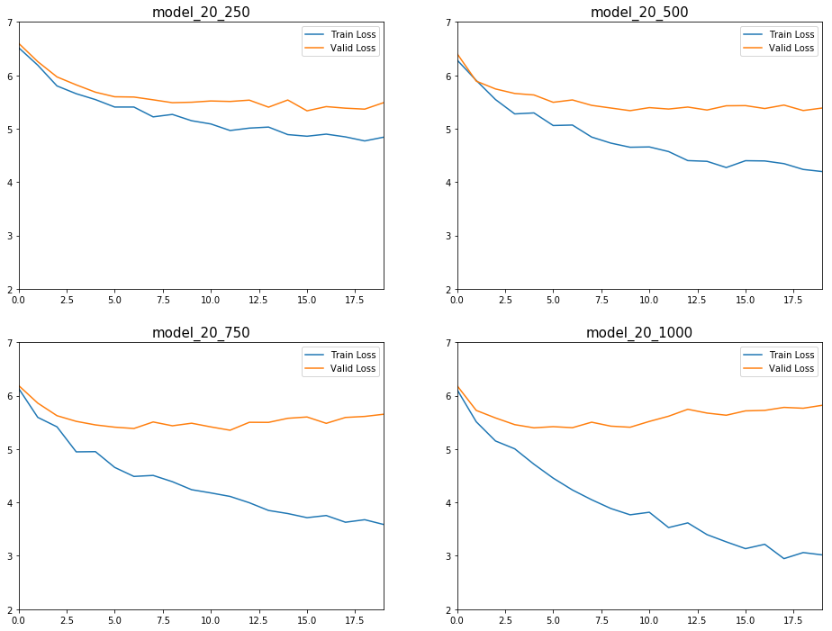

# Recurrent Network

## What is it and Why?

A Recurrent Neural Network (<b>RNN</b>) is a deep learning model used in Natural Language Processing (NLP). Usually it is used to predict a next word (or more) that comes after others. 

For example, if we are given a sentence 'My cat likes to drink [.......]', one might choose 'milk' while others go with 'water'. A model is trained on massive amount of phrases and using them, it tries to output a word that is most likely.

More details about NLP will be covered in later posts and here I will only show what and how I built a recurrent model.

The goal is to generate headlines given a starting word(s). The models which will be shown later are not trained long enough that its text generation are not so good but still be able to demonstrate how such a model predicts.

The following is an example of a phrase, generated with 'As an example'.


```python
generate_headlines(model_20_750, ["As an example,"], input_length=20, rnn_size=750)
```

    INFO:tensorflow:Restoring parameters from model/model_20_750
    Model model_20_750 Restored


    ['<START> as an example , apple takes the market game today and says they will get a big hit microsoft']


## Data Exploration

The data I used is from [UC Berkeley's CS182](https://www2.eecs.berkeley.edu/Courses/CS182/) (Designing, Visualizing and Understanding Deep Neural Networks). I'm not sure if I can share the data I used on public without their permission, so I'm only sharing my code and model weights only. But similar dataset can be downloaded from Kaggle Dataset, such as [A Million News Healines](https://www.kaggle.com/therohk/million-headlines) uploaded by Rohk.


```python
print(f'Number of data samples is {len(dataset)}')
print(f'Number of vocabulary is {len(vocabulary)}')
```

    Number of data samples is 89514
    Number of vocabulary is 10000


Vocabulary is a list that contains unique words that appear at least once in preprocessed dataset.


```python
vocabulary[:10]
```


    ['<START>', 'UNK', 'PAD', 'to', ',', 'apple', 'facebook', 'google', "'", 'in']


Dataset is a dictionary with elements: cut, mask numerized, title, and url.


```python
dataset[0]
```


    {'cut': 'training',
     'mask': [True,
      True,
      True,
      True,
      True,
      True,
      True,
      True,
      True,
      True,
      True,
      False,
      False,
      False,
      False,
      False,
      False,
      False,
      False,
      False],
     'numerized': [1958,
      11,
      5,
      1,
      256,
      6490,
      19,
      895,
      1,
      1,
      1,
      2,
      2,
      2,
      2,
      2,
      2,
      2,
      2,
      2],
     'title': 'Forget the Apple Watch. Set Reminders With These Elegant Mechanical Timepieces',
     'url': 'https://www.bloomberg.com/news/articles/2018-04-06/forget-the-apple-watch-set-reminders-with-these-elegant-mechanical-timepieces'}


The dataset is preprocessed so that all the titles (headlines) have the same fixed length of 20. If some of them are shorter than others, paddings are appended to match them. To distinguish those paddings from actual words, mask element is used which is boolean.

1. cut : indicates whether a sample is training or validation
2. title : News Headlines that we are going to use for both training and evaluation
3. url : The origin of each headline
4. mask : If True, it is an actual word in a headline. If False, it is a padding
5. numerzied : Maps a word to an index of vocabulary.


```python
vocabulary[:10]
```


    ['<START>', 'UNK', 'PAD', 'to', ',', 'apple', 'facebook', 'google', "'", 'in']


```python
# indices for start, padding and unknown
start, pad, unk = 0, 2, 1
```

<b>START</b> indicates the beginning position in a headline.<br> 
<b>PAD</b> indicates a padding added to a headline to match the length.<br>
<b>UNK</b> indicates an unknown word. This happens when vocabulary doesn't have a word which is used in samples.

First thing to do is to make a mapping from word to index. We cannot just pass string values into a deep network so any non-numeric values should first be converted. By making a dictionary of mapping, each unique word will have its own integer values.


```python
vocab_size = len(vocabulary)

word_to_index = {word:index for index, word in enumerate(vocabulary)}
word_to_index['google']
```


    7


So a model will predict the position of a word, instead of guessing a word of string directly.

Another thing I need is to translate those integers back to its original form so I can read them.


```python
sample = dataset[10]

sample_headline = sample['title']
sample_mask = sample['mask']
sample_numerized = sample['numerized']
```


```python
sample_numerized
```


    [92, 47, 2602, 11, 884, 438, 7274, 34, 932, 10, 6, 33, 2, 2, 2, 2, 2, 2, 2, 2]


```python
translate_numerized(sample_numerized)
```


    'can you pass the intelligence test solved by millions on facebook ?'


Note that any non-alphabet characters is considered as a separate word that 'facebook?' is translated to 'facebook ?'.

Another thing I need is to numerize a given sentence.


```python
sample_headline
```


    'Can you pass the intelligence test solved by millions on Facebook?'


```python
numerize(sample_headline)
```


    [92, 47, 2602, 11, 884, 438, 7274, 34, 932, 10, 6, 33]


All characters should be in lowercase to have less dimensions.


```python
train_data = [data for data in dataset if data['cut'] == 'training']
valid_data = [data for data in dataset if data['cut'] == 'validation']

len(train_data), len(valid_data)
```


    (88568, 946)


# Code

## Class Definition


```python
class Model():

    def __init__(self, input_length, vocab_size, rnn_size, 
                 learning_rate=1e-4, momentum=.85, decay=.9, beta1=.9, beta2=.99):
        
        self.input_num = tf.placeholder(tf.int32, shape=[None, input_length])
        self.targets = tf.placeholder(tf.int32, shape=[None, input_length])
        # True : Non-padding, False : Padding
        self.targets_mask = tf.placeholder(tf.bool, shape=[None, input_length])

        # Each vocab will have an embedding of rnn_size
        embedding = tf.get_variable('word_embeddings', [vocab_size, rnn_size])
        
        # Look up embedding of input_num
        # Looks up the embedding of given input_num
        map_embedding = tf.nn.embedding_lookup(embedding, self.input_num)

        # a LSTM cell for rnn
        lm_cell = tf.nn.rnn_cell.LSTMCell(rnn_size)
        lm_cell = tf.nn.rnn_cell.DropoutWrapper(lm_cell, .5, 1)
        
        # Run sequence of LSTM cells
        # dynamic_rnn returns outputs and states.
        # states are not used here so I didn't save it
        outputs, _ = tf.nn.dynamic_rnn(lm_cell, map_embedding, dtype=tf.float32)

        # Shape = [Batch_size][input_num][vocab_size]
        self.logits = tf.layers.dense(outputs, vocab_size)
        
        # mask weights so that only non-pad words are considered
        self.loss = tf.losses.sparse_softmax_cross_entropy(self.targets, self.logits, weights=tf.cast(self.targets_mask, dtype=np.float32))
        
        self.optimizer = tf.train.AdamOptimizer(learning_rate=learning_rate, beta1=beta1, beta2=beta2).minimize(self.loss)

        self.saver = tf.train.Saver()
```

## Train


```python
# model with different rembedding sizes

model_20_250 = 'model_20_250'
model_20_500 = 'model_20_500'
model_20_750 = 'model_20_750'
model_20_1000 = 'model_20_1000'
```


```python
# Took about 7 minutes

model_20_250_losses = train_model(model_name=model_20_250, rnn_size=250, iter_ver=1, epochs=20, load_model=False)
```

    Training a new Model : model_20_250
    Time : 19 Epoch : 1 Train Loss : 6.521451950073242 Valid Loss : 6.604078769683838
    Time : 19 Epoch : 2 Train Loss : 6.191676139831543 Valid Loss : 6.258332252502441
    Time : 19 Epoch : 3 Train Loss : 5.802998065948486 Valid Loss : 5.972076892852783
    Time : 18 Epoch : 4 Train Loss : 5.657375812530518 Valid Loss : 5.823077201843262
    Time : 19 Epoch : 5 Train Loss : 5.5470499992370605 Valid Loss : 5.685995578765869
    Time : 18 Epoch : 6 Train Loss : 5.4077229499816895 Valid Loss : 5.600042343139648
    Time : 18 Epoch : 7 Train Loss : 5.407564163208008 Valid Loss : 5.594792366027832
    Time : 18 Epoch : 8 Train Loss : 5.223485469818115 Valid Loss : 5.543225288391113
    Time : 19 Epoch : 9 Train Loss : 5.269318103790283 Valid Loss : 5.4890456199646
    Time : 18 Epoch : 10 Train Loss : 5.151086807250977 Valid Loss : 5.4974822998046875
    Time : 18 Epoch : 11 Train Loss : 5.090558052062988 Valid Loss : 5.521342754364014
    Time : 18 Epoch : 12 Train Loss : 4.9680047035217285 Valid Loss : 5.512088298797607
    Time : 19 Epoch : 13 Train Loss : 5.012817859649658 Valid Loss : 5.536990165710449
    Time : 18 Epoch : 14 Train Loss : 5.03235387802124 Valid Loss : 5.405229091644287
    Time : 18 Epoch : 15 Train Loss : 4.891358852386475 Valid Loss : 5.539577007293701
    Time : 18 Epoch : 16 Train Loss : 4.860981464385986 Valid Loss : 5.336805820465088
    Time : 18 Epoch : 17 Train Loss : 4.90013313293457 Valid Loss : 5.415666103363037
    Time : 19 Epoch : 18 Train Loss : 4.848421573638916 Valid Loss : 5.386229038238525
    Time : 19 Epoch : 19 Train Loss : 4.772733211517334 Valid Loss : 5.368454456329346
    Time : 18 Epoch : 20 Train Loss : 4.844111442565918 Valid Loss : 5.491779327392578


```python
# Took about 10 minutes

model_20_500_losses = train_model(model_name=model_20_500, rnn_size=500, iter_ver=1, epochs=20, load_model=False)
```

    Training a new Model : model_20_500
    Time : 31 Epoch : 1 Train Loss : 6.290328502655029 Valid Loss : 6.409896373748779
    Time : 30 Epoch : 2 Train Loss : 5.906001567840576 Valid Loss : 5.892825126647949
    Time : 30 Epoch : 3 Train Loss : 5.54813289642334 Valid Loss : 5.746621608734131
    Time : 30 Epoch : 4 Train Loss : 5.278981685638428 Valid Loss : 5.661812782287598
    Time : 30 Epoch : 5 Train Loss : 5.29741907119751 Valid Loss : 5.633823871612549
    Time : 30 Epoch : 6 Train Loss : 5.061626434326172 Valid Loss : 5.496407985687256
    Time : 30 Epoch : 7 Train Loss : 5.070347785949707 Valid Loss : 5.540763854980469
    Time : 30 Epoch : 8 Train Loss : 4.845116138458252 Valid Loss : 5.439145565032959
    Time : 30 Epoch : 9 Train Loss : 4.731771469116211 Valid Loss : 5.389241695404053
    Time : 30 Epoch : 10 Train Loss : 4.6543989181518555 Valid Loss : 5.339622974395752
    
    ===== Model model_20_500 saved =====
    
    Time : 30 Epoch : 11 Train Loss : 4.660418510437012 Valid Loss : 5.396697044372559
    Time : 30 Epoch : 12 Train Loss : 4.57363224029541 Valid Loss : 5.370182514190674
    Time : 30 Epoch : 13 Train Loss : 4.404289245605469 Valid Loss : 5.407248020172119
    Time : 30 Epoch : 14 Train Loss : 4.3906779289245605 Valid Loss : 5.3517842292785645
    Time : 30 Epoch : 15 Train Loss : 4.274456024169922 Valid Loss : 5.4311394691467285
    Time : 30 Epoch : 16 Train Loss : 4.4022932052612305 Valid Loss : 5.4341654777526855
    Time : 30 Epoch : 17 Train Loss : 4.397609710693359 Valid Loss : 5.379759311676025
    Time : 30 Epoch : 18 Train Loss : 4.347304821014404 Valid Loss : 5.444421768188477
    Time : 30 Epoch : 19 Train Loss : 4.238630294799805 Valid Loss : 5.342272758483887
    Time : 30 Epoch : 20 Train Loss : 4.198734283447266 Valid Loss : 5.389731407165527
    
    ===== Model model_20_500 saved =====
    


```python
# Took about 16 minutes

model_20_750_losses = train_model(model_name=model_20_750, rnn_size=750, iter_ver=1, epochs=20, load_model=False)
```

    Training a new Model : model_20_750
    Time : 47 Epoch : 1 Train Loss : 6.1389970779418945 Valid Loss : 6.1926984786987305
    Time : 46 Epoch : 2 Train Loss : 5.594339847564697 Valid Loss : 5.8611931800842285
    Time : 47 Epoch : 3 Train Loss : 5.416676044464111 Valid Loss : 5.625517845153809
    Time : 46 Epoch : 4 Train Loss : 4.947951316833496 Valid Loss : 5.519547939300537
    Time : 47 Epoch : 5 Train Loss : 4.95191764831543 Valid Loss : 5.4528422355651855
    Time : 47 Epoch : 6 Train Loss : 4.656552314758301 Valid Loss : 5.410458564758301
    Time : 46 Epoch : 7 Train Loss : 4.487500190734863 Valid Loss : 5.385641574859619
    Time : 47 Epoch : 8 Train Loss : 4.506504535675049 Valid Loss : 5.50782585144043
    Time : 47 Epoch : 9 Train Loss : 4.389082431793213 Valid Loss : 5.436454772949219
    Time : 46 Epoch : 10 Train Loss : 4.239155292510986 Valid Loss : 5.48450231552124
    
    ===== Model model_20_750 saved =====
    
    Time : 47 Epoch : 11 Train Loss : 4.178558826446533 Valid Loss : 5.415424823760986
    Time : 47 Epoch : 12 Train Loss : 4.1129560470581055 Valid Loss : 5.353113174438477
    Time : 47 Epoch : 13 Train Loss : 3.994833469390869 Valid Loss : 5.501667499542236
    Time : 46 Epoch : 14 Train Loss : 3.8501088619232178 Valid Loss : 5.500241756439209
    Time : 47 Epoch : 15 Train Loss : 3.7922282218933105 Valid Loss : 5.576651096343994
    Time : 47 Epoch : 16 Train Loss : 3.715085029602051 Valid Loss : 5.601257801055908
    Time : 46 Epoch : 17 Train Loss : 3.7551517486572266 Valid Loss : 5.482297420501709
    Time : 46 Epoch : 18 Train Loss : 3.6295158863067627 Valid Loss : 5.592514514923096
    Time : 46 Epoch : 19 Train Loss : 3.676734209060669 Valid Loss : 5.611507415771484
    Time : 46 Epoch : 20 Train Loss : 3.5860989093780518 Valid Loss : 5.653334617614746
    
    ===== Model model_20_750 saved =====
    


```python
# Took about 22 minutes

model_20_1000_losses = train_model(model_name=model_20_1000, rnn_size=1000, iter_ver=1, epochs=20, load_model=False)
```

    Training a new Model : model_20_1000
    Time : 67 Epoch : 1 Train Loss : 6.116085529327393 Valid Loss : 6.189640045166016
    Time : 67 Epoch : 2 Train Loss : 5.5112504959106445 Valid Loss : 5.724303245544434
    Time : 67 Epoch : 3 Train Loss : 5.151978969573975 Valid Loss : 5.583501815795898
    Time : 67 Epoch : 4 Train Loss : 5.004917621612549 Valid Loss : 5.457799911499023
    Time : 67 Epoch : 5 Train Loss : 4.716437339782715 Valid Loss : 5.398298740386963
    Time : 67 Epoch : 6 Train Loss : 4.456024646759033 Valid Loss : 5.4200758934021
    Time : 67 Epoch : 7 Train Loss : 4.233898639678955 Valid Loss : 5.400672912597656
    Time : 67 Epoch : 8 Train Loss : 4.05080509185791 Valid Loss : 5.503702163696289
    Time : 67 Epoch : 9 Train Loss : 3.8865251541137695 Valid Loss : 5.429373741149902
    Time : 67 Epoch : 10 Train Loss : 3.7687785625457764 Valid Loss : 5.409214019775391
    
    ===== Model model_20_1000 saved =====
    
    Time : 67 Epoch : 11 Train Loss : 3.8164422512054443 Valid Loss : 5.518129348754883
    Time : 67 Epoch : 12 Train Loss : 3.529740810394287 Valid Loss : 5.615565776824951
    Time : 67 Epoch : 13 Train Loss : 3.6172564029693604 Valid Loss : 5.745477199554443
    Time : 67 Epoch : 14 Train Loss : 3.3971619606018066 Valid Loss : 5.674541473388672
    Time : 67 Epoch : 15 Train Loss : 3.2620558738708496 Valid Loss : 5.634144306182861
    Time : 67 Epoch : 16 Train Loss : 3.134613513946533 Valid Loss : 5.71579122543335
    Time : 67 Epoch : 17 Train Loss : 3.2164762020111084 Valid Loss : 5.724960803985596
    Time : 67 Epoch : 18 Train Loss : 2.94749116897583 Valid Loss : 5.780954360961914
    Time : 67 Epoch : 19 Train Loss : 3.0615322589874268 Valid Loss : 5.765078544616699
    Time : 67 Epoch : 20 Train Loss : 3.0173232555389404 Valid Loss : 5.820944786071777
    
    ===== Model model_20_1000 saved =====
    


### Losses of Each Model



As the number of <b>rnn_size</b> (shape of an embedding) increases, it overfits faster that we can see from the graph valid loss increases as well. However by the looks of the plots, using small rnn_size stops learning earlier than larger sizes so such parameters should be chosen carefully by exploring more combinations.

## Prediction

### Headline Generation


```python
starting_words = ['court', 'samsung', 'apple', 'google', 'google and apple', 'google and samsung', 'samsung and apple']
```


```python
pred_20_250
```


    ['<START> court says apple must pay $ 1 billion in taxes in patent case - sources say wsj says wsj',
     '<START> samsung loses bid for patent infringement case against apple in germany case against samsung galaxy tab : what it',
     "<START> apple is said for plan for tv series with new iphone x - here's what it looks like in",
     "<START> google says it will be forgotten ' right ' in china ' eu antitrust probe by mps over data",
     "<START> google and apple pay in china over iphone 5 ' month ' in china ' in the u.s .",
     '<START> google and samsung are said in talks with mobile software on mobile phones - wsj says it will be',
     '<START> samsung and apple are said in talks with samsung over tablet sales in china - report says no iphone']


```python
pred_20_500
```


    ['<START> court rules in favor of apple iphone 4s delayed in china after report of iphone 4s launch claims in',
     '<START> samsung loses bid for apple in japan patent case : u.s. appeals court ruling on samsung phone ban :',
     '<START> apple iphone 5 : review roundup : the best deals ! the world ? not so much yet ?',
     '<START> google and facebook are the most in the high for the tech industry market market cap in the week',
     "<START> google and apple face new privacy concerns in france probe of youtube ads in india crackdown probe says '",
     "<START> google and samsung are not a war on the apple car project : ' we are not so much",
     '<START> samsung and apple end patent fight with u.s. smartphone market war with u.s . . . ) says on']


```python
pred_20_750
```


    ['<START> court says facebook must pay $ 1 billion in virtual reality lawsuit case case case case against facebook data',
     '<START> samsung says it will release a new apple tv and security for its own xbox one shows what it',
     '<START> apple iphone 4s event : watch review : what it happened on how the ipad pro fire is better',
     "<START> google launches new chrome browser for android users with apple's ipad and iphone 8 owners on mac devices in",
     '<START> google and apple are reportedly building a car that can compete with the iphone that that could be affected',
     '<START> google and samsung face smartphone makers in europe trial for android devices and more control 8.1 of times android',
     "<START> samsung and apple are reportedly a new smartphone in the u.s . . . . . . it's great"]


```python
pred_20_1000
```


    ['<START> court says samsung case loss on apple is infringe patents in patent case case against filing suit against suit',
     '<START> samsung galaxy products beats apple as new galaxy s smartphone 3 drop in the u.s . . on net',
     '<START> apple says it will add more than itunes in the u.s . . . 100 percent because why is',
     '<START> google says it will pay $ 100 million in eu over security in security and for the company will',
     '<START> google and apple have a huge investment in the cloud wars with technology and amazon and not complicated .',
     "<START> google and samsung in sign deal for a new deal with machine learning and tv shows why they can't",
     "<START> samsung and apple ' top pick ' for ipad turns too late ' : ' edition isn't not a"]


The link to the weights is below so if you want, you can download them and try other words or train.

# Conclusion


```python
# A weird conclusion

generate_headlines(model_20_750, ['to end this post,'], input_length=20, rnn_size=750)
```

    INFO:tensorflow:Restoring parameters from model/model_20_750
    Model model_20_750 Restored


    ['<START> to end this post , a former facebook post has found a new york president in the 2016 -']


There are already many other and much better models than this such as bi-LSTM model, BERT or transformer that could predict and generate much longer sentences. For example, models in the post is unidirectional that it only reads phrases from left to right but bidirectional models learn from left to right and from right to left that it can learn patterns better.

Although models here are trained with the maximum of 20 words, by padding dataset more one can produce much longer sentences. 

As mentioned above, I'm not sure if I can share the data without having their consent, but you can still get the weights of each model at [my drive](https://drive.google.com/open?id=1BkG8Xr8eBldwGhhUvazrGCoS5RzPHKM_) and view the full code at [my github](https://github.com/hsong1101/Text-Generation).

Again, thank you for reading this and if you find any errors, typos or have any suggestions, please let me know.
